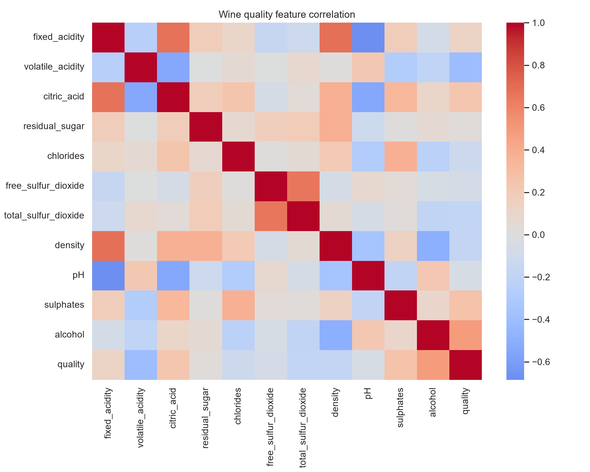
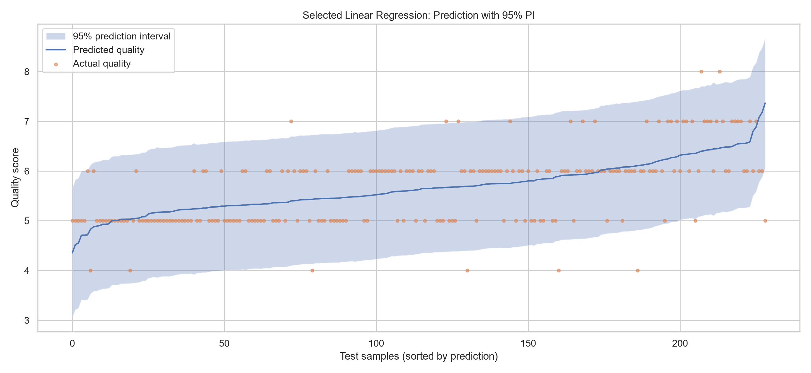
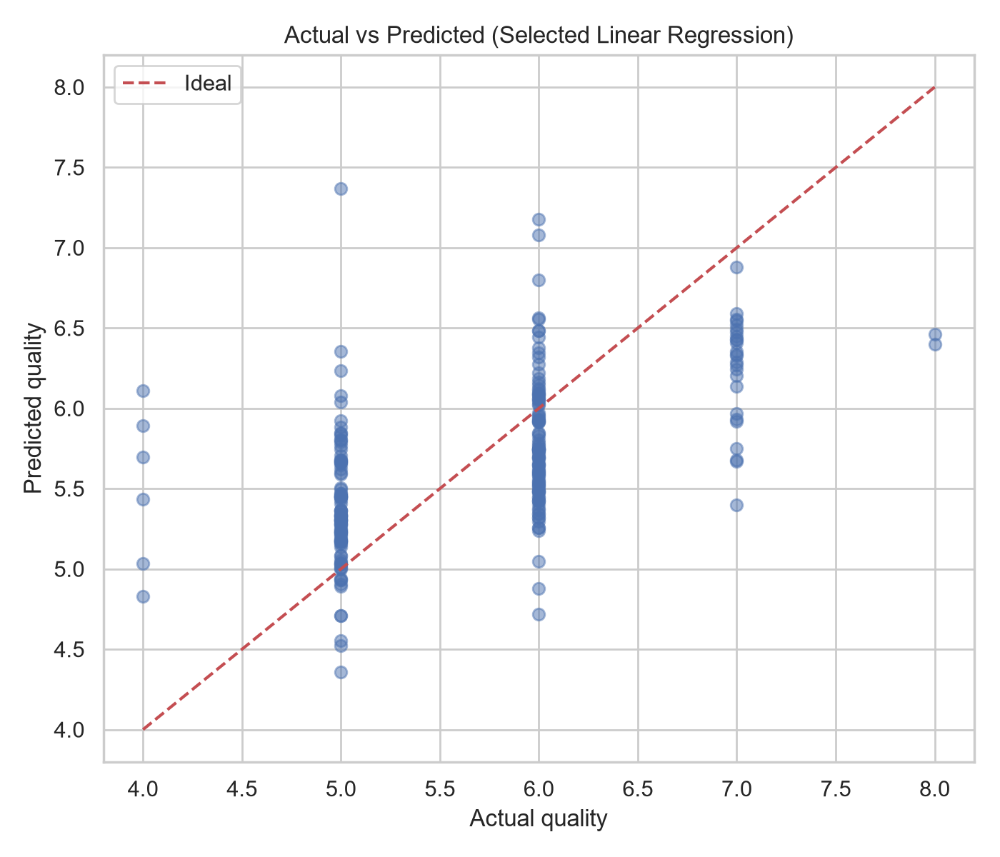
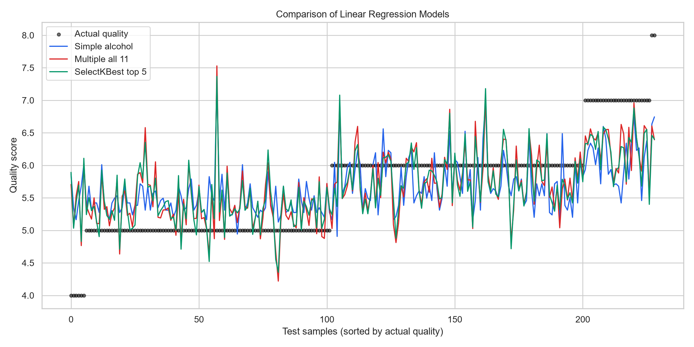
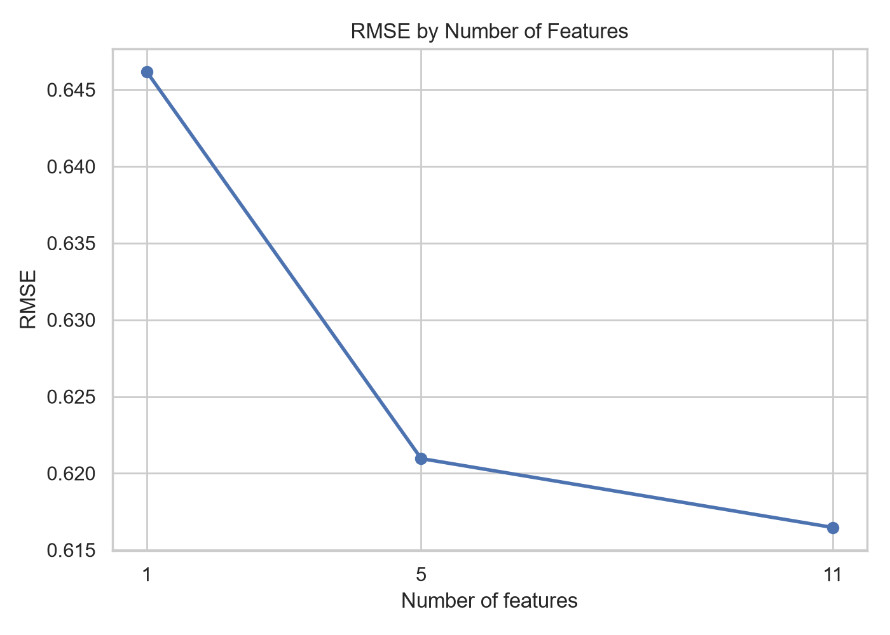
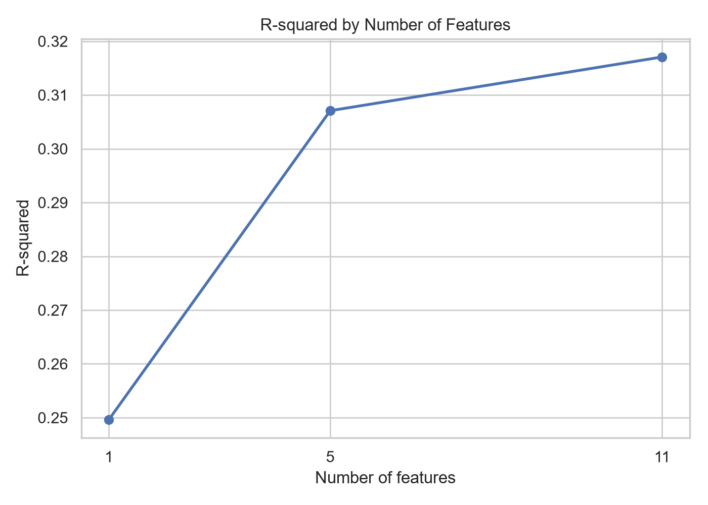

# Wine Quality Dataset：線性回歸研究與 CRISP-DM 專題報告

> 撰寫日期：2026-10-08。此文件為研究規劃與可重現實驗程式；模型數字與圖片須實際執行程式後填入，不虛構實驗結果。

## 一、資料集資格與結論

- Kaggle：https://www.kaggle.com/datasets/yasserh/wine-quality-dataset
- 原始來源 UCI：https://archive.ics.uci.edu/dataset/186/wine+quality
- **Kaggle 名次：不適用（N/A）。** 此連結是 Kaggle Dataset 資料集頁面，不是 Kaggle Competition 競賽頁面，因此沒有官方排行榜、參賽隊伍或提交分數名次。Kaggle 頁面上的 views、downloads、Usability 分數及 Related Notebooks 的獎章，均不是本研究模型的競賽名次。
- Kaggle 下載檔案通常為 `WineQT.csv`，有 11 個理化輸入特徵、1 個輸出 `quality`，另可能有 `Id` 識別碼。`Id` 不可作為預測特徵。
- **符合 10 至 20 個 features 要求：11 個。** 注意：特徵選擇後的模型可以只使用部分特徵；資料集原始特徵數仍為 11。
- 品質分數 `quality` 為離散、有序分數，仍可作為線性回歸的數值目標，但預測可能超出實際分數範圍；報告須交代此限制。
- 單變數線性回歸與多元線性回歸皆可行。Auto Regression 自迴歸依賴時間順序，本資料非時間序列，不建議使用。

## 二、欄位與角色

| 欄位 | 角色 | 說明 |
|---|---|---|
| fixed acidity | X | 固定酸度 |
| volatile acidity | X | 揮發性酸度 |
| citric acid | X | 檸檬酸 |
| residual sugar | X | 殘糖 |
| chlorides | X | 氯化物 |
| free sulfur dioxide | X | 游離二氧化硫 |
| total sulfur dioxide | X | 總二氧化硫 |
| density | X | 密度 |
| pH | X | 酸鹼值 |
| sulphates | X | 硫酸鹽 |
| alcohol | X | 酒精濃度 |
| quality | y | 品質評分（目標） |
| Id（若存在） | 排除 | 索引／識別碼，避免假相關 |

UCI 提供紅、白葡萄酒原始資料集（紅酒 1599 筆、白酒 4898 筆）；**本次指定的 Kaggle WineQT.csv 為其衍生版本，資料筆數須以實際下載 CSV 為準，不應直接將 UCI 白酒的 4898 筆視為本 Kaggle 檔案筆數。**

## 三、研究目的與假設

研究問題：能否依據葡萄酒的理化測量數值預測其感官品質分數？特徵篩選能否在減少輸入維度的同時維持預測準確性？

- H1：多元線性回歸優於只用 alcohol 的單變數線性回歸。
- H2：以訓練集進行統計特徵篩選後，能以較少變數得到具競爭力的測試誤差。
- 注意：H1、H2 為**待驗證假設**，不是研究結論。

## 四、CRISP-DM 六大階段

### 1. Business Understanding（商業理解）

酒商或品管單位希望在感官品評之前，根據可測得的化學指標進行初步品質估計，協助品質管理與分析。成功準則為低 MAE / RMSE、合理 R²，以及可解釋且可使用的預測區間。不以此模型取代專業品酒評估。

### 2. Data Understanding（資料理解）

使用 `head()`、`info()`、`describe()`、缺失值檢查、重複值分析、品質分數分布、特徵相關性熱圖。核實實際 CSV 的筆數、欄位、資料型態與 `quality` 不均衡現象。檢查同一欄位極端值及共線性。

### 3. Data Preparation（資料準備）

移除 `Id`，設定 `quality` 為 y、其餘 11 欄為 X。以固定 random_state 進行 80/20 訓練與測試切分。不得在切分前依全體資料選特徵或標準化，避免資料洩漏。特徵篩選只在訓練集進行。若有缺失值，須先於訓練資料上擬合補值器（範例採 sklearn Pipeline）。重複樣本需檢查並交代處理策略，避免同一紀錄同時出現在訓練和測試資料。

### 4. Modeling（模型建立）

- 模型 A：Simple Linear Regression；只用 `alcohol` 作為自變數。
- 模型 B：Multiple Linear Regression；11 個理化特徵全部納入。
- 模型 C：Feature Selection + Multiple Linear Regression；訓練集以 `SelectKBest(f_regression, k=5)` 選出 5 個特徵後建模。
- 迴歸模型公式：`quality_hat = β0 + β1*x1 + … + βp*xp`。
- k=5 是事先指定的可重現展示設定，不代表實證最優；若要調整 k，需在訓練資料內執行交叉驗證，不可偷看測試集。

### 5. Evaluation（模型評估）

評估保留測試集上的 MAE、MSE、RMSE、R²，搭配實際值與預測值散佈圖、殘差圖、95% 預測區間圖、預測區間涵蓋率與平均寬度。比較三個模型；特徵數與解釋力也是評估指標。對單筆未來葡萄酒分數，**預測區間（Prediction Interval）比均值信賴區間（Confidence Interval）更符合題意**；前者考慮單筆資料的不可預測變動，因此通常更寬。OLS 的經典區間假設包括線性形式、誤差常態與同質變異等，需檢視殘差。若區間超出 0–10 需在報告中說明。

### 6. Deployment（部署）

將表現合宜的特徵選擇器與回歸模型保存為 `joblib` Pipeline，未來可透過 Python 腳本、Streamlit 或 FastAPI 輸入理化指標得到預估品質分數。部署後需記錄資料版本、特徵名稱與模型版本，監測新資料分布漂移及預測誤差；如需部署預測區間，也須保存相對應的統計模型及特徵順序。

## 五、實作流程與完整 Python 程式

環境（本機或 Google Colab）：`pip install pandas numpy matplotlib seaborn scikit-learn statsmodels joblib kagglehub`。程式會使用 `kagglehub` 自動下載指定 Kaggle 資料集；若執行目錄已有 `WineQT.csv`，則優先使用本地檔案。獨立可執行版本為 `5115056030_hw2.py`，可在 Colab 上先執行安裝指令，再上傳並執行該檔案。

```python
from pathlib import Path
import numpy as np
import pandas as pd
import matplotlib.pyplot as plt
import seaborn as sns
import joblib
import kagglehub
import statsmodels.api as sm
from sklearn.model_selection import train_test_split
from sklearn.feature_selection import SelectKBest, f_regression
from sklearn.linear_model import LinearRegression
from sklearn.impute import SimpleImputer
from sklearn.pipeline import Pipeline
from sklearn.metrics import mean_absolute_error, mean_squared_error, r2_score

# 優先使用同目錄的本地檔案；沒有時才從 KaggleHub 下載，便於重複執行與離線測試。
PATH = Path("WineQT.csv")
if not PATH.exists():
    dataset_dir = Path(kagglehub.dataset_download("yasserh/wine-quality-dataset"))
    candidates = list(dataset_dir.rglob("WineQT.csv"))
    if not candidates:
        candidates = list(dataset_dir.rglob("*.csv"))
    if not candidates:
        raise FileNotFoundError(
            f"KaggleHub 下載完成，但在 {dataset_dir} 找不到 CSV 資料檔"
        )
    PATH = candidates[0]
    print("KaggleHub 資料路徑：", PATH)

df = pd.read_csv(PATH)
df.columns = df.columns.str.strip().str.replace(" ", "_", regex=False)
print("資料維度：", df.shape)
print("欄位：", df.columns.tolist())
print("缺失值：\n", df.isna().sum())
print("quality 分布：\n", df["quality"].value_counts().sort_index())

# 此 Kaggle CSV 可能有 Id；明確移除識別碼。
df = df.drop(columns=["Id", "id"], errors="ignore")
X = df.drop(columns=["quality"])
y = df["quality"]
assert X.shape[1] == 11, f"預期 11 個輸入特徵，實際 {X.shape[1]}。請檢查檔案。"
assert "alcohol" in X.columns

plt.figure(figsize=(10, 8))
sns.heatmap(df.corr(numeric_only=True), cmap="coolwarm", center=0)
plt.title("Feature correlation")
plt.tight_layout()
plt.savefig("01_correlation_heatmap.png", dpi=180)
plt.close()

X_train, X_test, y_train, y_test = train_test_split(
    X, y, test_size=0.20, random_state=42
)

models = {
    "A_Simple_alcohol": ( ["alcohol"], Pipeline([
        ("imputer", SimpleImputer(strategy="median")),
        ("reg", LinearRegression())
    ])),
    "B_Multiple_all11": (list(X.columns), Pipeline([
        ("imputer", SimpleImputer(strategy="median")),
        ("reg", LinearRegression())
    ])),
    "C_Selected_top5": (list(X.columns), Pipeline([
        ("imputer", SimpleImputer(strategy="median")),
        ("select", SelectKBest(score_func=f_regression, k=5)),
        ("reg", LinearRegression())
    ]))
}

results = []
for name, (columns, model) in models.items():
    model.fit(X_train[columns], y_train)
    prediction = model.predict(X_test[columns])
    mse = mean_squared_error(y_test, prediction)
    selected_cols = columns
    if name == "C_Selected_top5":
        selected_cols = X_train[columns].columns[
            model.named_steps["select"].get_support()
        ].tolist()
    results.append({
        "Model": name,
        "Features": ", ".join(selected_cols),
        "N_features": len(selected_cols),
        "MAE": mean_absolute_error(y_test, prediction),
        "MSE": mse,
        "RMSE": np.sqrt(mse),
        "R2": r2_score(y_test, prediction)
    })
    joblib.dump(model, f"{name}.joblib")

metrics = pd.DataFrame(results).sort_values("RMSE")
print(metrics.to_string(index=False))
metrics.to_csv("02_model_metrics.csv", index=False, encoding="utf-8-sig")

# 以事先指定的模型 C 製作 95% 單筆預測區間（不依測試成績挑模型）。
selected_pipe = models["C_Selected_top5"][1]
selector = selected_pipe.named_steps["select"]
selected_names = X_train.columns[selector.get_support()].tolist()
imputer = selected_pipe.named_steps["imputer"]
tr_array = imputer.transform(X_train)
te_array = imputer.transform(X_test)
tr_selected = selector.transform(tr_array)
te_selected = selector.transform(te_array)

# 在訓練集上以相同欄位重新擬合 OLS，取得統計推論的預測區間。
X_ols_train = sm.add_constant(tr_selected, has_constant="add")
X_ols_test = sm.add_constant(te_selected, has_constant="add")
ols = sm.OLS(y_train.to_numpy(), X_ols_train).fit()
frame = ols.get_prediction(X_ols_test).summary_frame(alpha=0.05)

# 排序只是為了使圖易讀，區間仍是對每一個測試樣本的估計。
idx = np.argsort(frame["mean"].to_numpy())
actual = y_test.to_numpy()[idx]
pred = frame["mean"].to_numpy()[idx]
lower = frame["obs_ci_lower"].to_numpy()[idx]
upper = frame["obs_ci_upper"].to_numpy()[idx]
xaxis = np.arange(len(idx))

plt.figure(figsize=(13, 6))
plt.fill_between(xaxis, lower, upper, alpha=0.28, label="95% prediction interval")
plt.plot(xaxis, pred, linewidth=1.6, label="Predicted quality")
plt.scatter(xaxis, actual, s=12, alpha=0.6, label="Actual quality")
plt.xlabel("Test samples (sorted by prediction)")
plt.ylabel("Quality score")
plt.title("Selected Linear Regression: Prediction with 95% PI")
plt.legend()
plt.tight_layout()
plt.savefig("03_prediction_interval.png", dpi=200)
plt.close()

plt.figure(figsize=(7, 6))
plt.scatter(y_test, frame["mean"], alpha=0.5)
lims = [min(y_test.min(), frame["mean"].min()),
        max(y_test.max(), frame["mean"].max())]
plt.plot(lims, lims, "r--", label="Ideal")
plt.xlabel("Actual quality")
plt.ylabel("Predicted quality")
plt.title("Actual vs Predicted (Selected Linear Regression)")
plt.legend()
plt.tight_layout()
plt.savefig("04_actual_vs_predicted.png", dpi=200)
plt.close()

coverage = np.mean((y_test.to_numpy() >= frame["obs_ci_lower"].to_numpy()) &
                   (y_test.to_numpy() <= frame["obs_ci_upper"].to_numpy()))
print("模型 C 選入特徵：", selected_names)
print("95% PI 實際涵蓋率：", round(coverage, 4))
print("PI 平均寬度：", round(np.mean(upper-lower), 4))
print("輸出圖片：01_correlation_heatmap.png、03_prediction_interval.png、04_actual_vs_predicted.png")
```

### 程式產出

1. `01_correlation_heatmap.png`：相關係數熱圖。
2. `02_model_metrics.csv`：A、B、C 三個模型的 MAE / MSE / RMSE / R²。
3. `03_prediction_interval.png`：**實際品質 vs. 預測品質 + 95% Prediction Interval**（題目必要）。
4. `04_actual_vs_predicted.png`：預測值與真實值散佈圖。
5. 三份 `.joblib`：訓練好的 pipeline。

**避免誤解：** `03_prediction_interval.png` 需下載 CSV 執行後才會生成；此份 Markdown 本身沒有宣稱已實際完成模型測試。程式使用 OLS 殘差估計傳統、模型假設成立下的參數式預測區間；區間涵蓋率仍需實際驗證。

## 視覺化結果

以下圖表均由 `5115056030_hw2.py` 使用本次 Wine Quality 測試集實際產生。附件中的 Profit/R&D Spend 圖屬於不同資料集，因此不納入本報告。

### 原始分析圖







### 模型比較圖







## 參考資料

1. Kaggle, Wine Quality Dataset. https://www.kaggle.com/datasets/yasserh/wine-quality-dataset
2. UCI Machine Learning Repository, Wine Quality. https://archive.ics.uci.edu/dataset/186/wine+quality
3. Yasser H., Wine Quality Prediction — Comparing Top ML Models. https://www.kaggle.com/code/yasserh/wine-quality-prediction-comparing-top-ml-models
4. Cortez, P., et al. (2009). *Modeling wine preferences by data mining from physicochemical properties*. Decision Support Systems.
